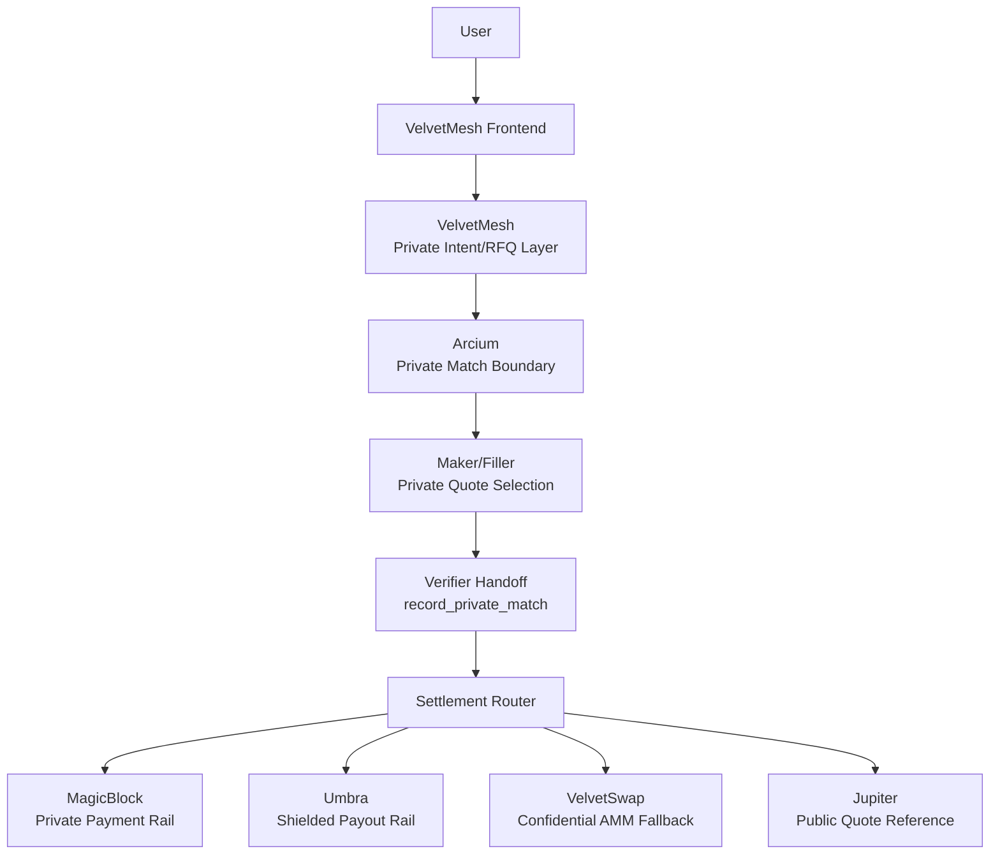
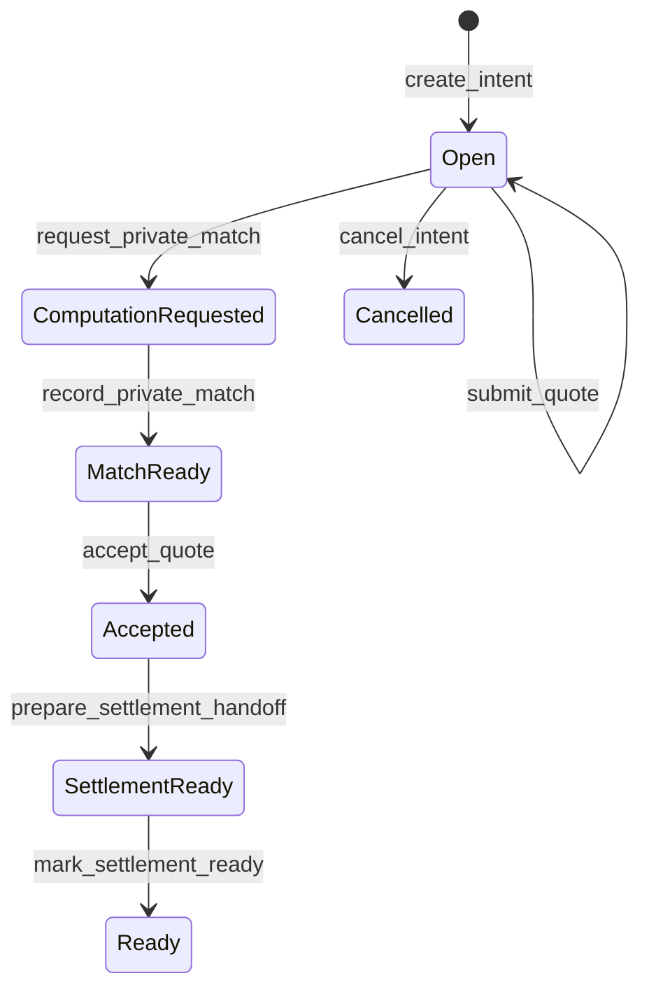

# VelvetMesh Architecture

> Private intent liquidity on top of VelvetSwap.

## Architecture Goal

VelvetMesh is the product evolution of VelvetSwap, not a separate rewrite.
VelvetSwap remains the confidential AMM and settlement foundation. VelvetMesh
adds a private intent and RFQ layer so the full product becomes:

1. Create an encrypted intent.
2. Collect private maker/filler quotes.
3. Request a private match boundary through Arcium.
4. Accept the verified quote.
5. Settle privately through MagicBlock and shield the payout through Umbra.

The architecture should always explain that path first. The fallback AMM exists,
but it is not the main user story anymore.

## Layer Model


```mermaid
graph TB
    USER["User"]
    FRONTEND["VelvetMesh Frontend"]
    INTENT["VelvetMesh<br/>Private Intent/RFQ Layer"]
    ARCIUM["Arcium<br/>Private Match Boundary"]
    MATCH["Maker/Filler<br/>Private Quote Selection"]
    VERIFY["Verifier Handoff<br/>record_private_match"]
    ROUTER["Settlement Router"]
    MAGIC["MagicBlock<br/>Private Payment Rail"]
    UMBRA["Umbra<br/>Shielded Payout Rail"]
    SWAP["VelvetSwap<br/>Confidential AMM Fallback"]
    JUP["Jupiter<br/>Public Quote Reference"]

    USER --> FRONTEND
    FRONTEND --> INTENT
    INTENT --> ARCIUM
    ARCIUM --> MATCH
    MATCH --> VERIFY
    VERIFY --> ROUTER
    ROUTER --> MAGIC
    ROUTER --> UMBRA
    ROUTER --> SWAP
    ROUTER --> JUP
```

## Current Repo Truth

The repo contains three important implementation layers:

- `programs/light_swap_psp`: VelvetSwap confidential AMM foundation.
- `programs/velvet_mesh`: private intent/RFQ state machine.
- `arcium/velvet_mesh_matcher`: isolated Arcium matcher workspace.

The current product should be described in terms of those layers, not as a
generic sponsor showcase.

## State Flow


```mermaid
stateDiagram-v2
    [*] --> Open: create_intent
    Open --> Open: submit_quote
    Open --> ComputationRequested: request_private_match
    ComputationRequested --> MatchReady: record_private_match
    MatchReady --> Accepted: accept_quote
    Accepted --> SettlementReady: prepare_settlement_handoff
    SettlementReady --> Ready: mark_settlement_ready
    Open --> Cancelled: cancel_intent
```

## Meaning Of Each Stage

### `create_intent`

The user creates a private trade intent with encrypted size, price, and route
preferences.

### `submit_quote`

Makers or fillers attach private quote commitments to the open intent.

### `request_private_match`

The intent is moved into private computation. This is where Arcium becomes the
match boundary.

### `record_private_match`

This is the trust boundary. A verifier records the winning quote commitment,
route, and computation id. Until this exists, the intent should not be
presented as settleable.

### `accept_quote`

The owner accepts the verified quote once the match is ready.

### `prepare_settlement_handoff`

The owner records the settlement payload hash for the selected route.

### `mark_settlement_ready`

The configured settlement verifier confirms the handoff and allows settlement.

## Settlement Router

The settlement router is route selection, not a marketing list.

- **MagicBlock** handles the private USDC payment rail.
- **Umbra** handles the shielded payout/balance rail.
- **VelvetSwap** remains the confidential AMM fallback.
- **Jupiter** is the public quote reference and comparison rail.

The architecture should make it obvious that the system can settle through
different rails while keeping the same private intent story.

## Product Constraints

The repo is intentionally strict about a few things:

- Arcium-backed intents are not settleable until the verifier-gated match path
  exists.
- Sponsor settlement fails closed if the payload or verifier is wrong.
- The fallback AMM should not be described as production-complete encrypted
  constant-product math until that path is verified.
- Ika stays parked in the current product narrative until there is a real
  Solana MPC path worth shipping.

## Frontend Relationship

The separate frontend repo is responsible for presenting the product:

- private intent creation
- quote lifecycle
- match readiness
- settlement receipts
- explorer links and market references

That frontend should read like one product surface, not three sponsor demos.

## Repo Summary

```txt
programs/
  light_swap_psp/          # VelvetSwap confidential AMM fallback
  velvet_mesh/             # private intent/RFQ state machine

arcium/
  velvet_mesh_matcher/     # private match workspace

README.md                  # product narrative
ARCHITECTURE.md            # current architecture and trust boundaries
```

