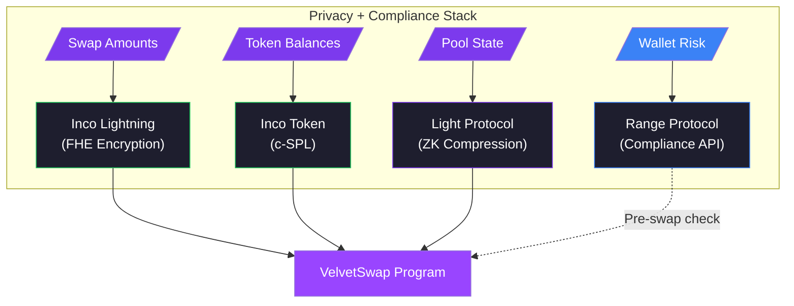
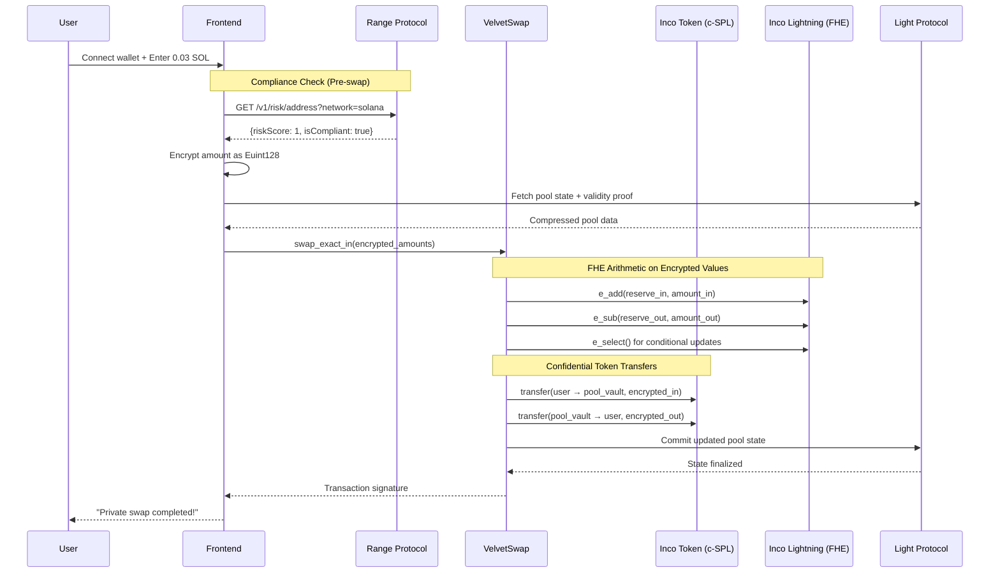
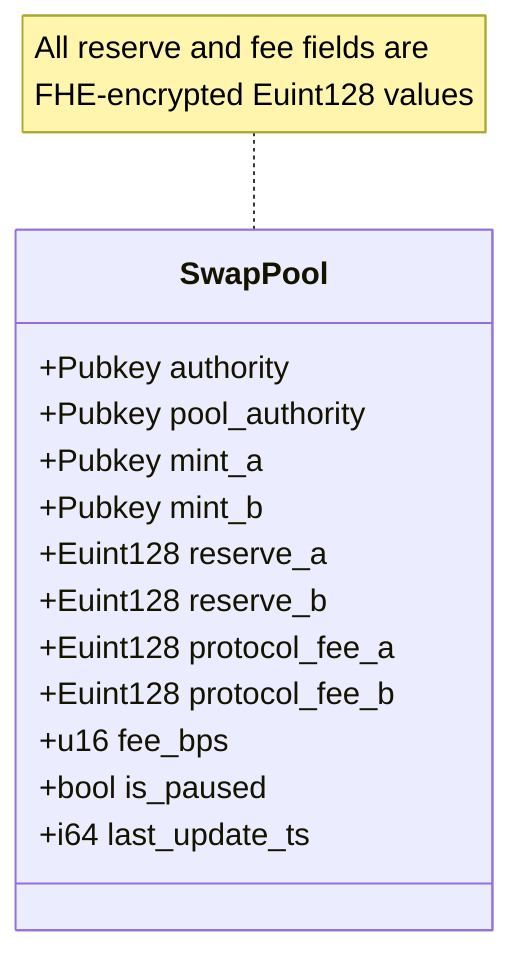

# VelvetSwap — Confidential AMM for Solana

[](https://solana.com)
[](https://lightprotocol.com)
[](https://inco.network)
[](https://range.org)

## Privacy + Compliance Stack

| Layer | Technology | Purpose |
|-------|------------|------------------|
| **FHE (Inco Lightning)** | Homomorphic encryption | Pool reserves, swap amounts, fees - all encrypted as `Euint128` |
| **c-SPL (Inco Token)** | Confidential tokens | User balances stored encrypted, transfers hide amounts |
| **ZK (Light Protocol V2)** | Zero-knowledge proofs | Pool state stored as compressed account with validity proofs |
| **Compliance (Range)** | Risk API | Sanctions screening & wallet risk scoring before swaps |

---

## Overview

VelvetSwap is a **constant-product AMM** where nobody — not validators, not indexers, not MEV bots — can see how much you're swapping.



---

## Deployed Program

| Field | Value |
|-------|-------|
| **Program ID** | `4b8jCufu7b4WKXdxFRQHWSks4QdskW62qF7tApSNXuZD` |
| **Network** | Solana Devnet |
| **Inco Token Program** | `CYVSeUyVzHGVcrxsJt3E8tbaPCQT8ASdRR45g5WxUEW7` |
| **Inco Lightning Program** | `5sjEbPiqgZrYwR31ahR6Uk9wf5awoX61YGg7jExQSwaj` |
| **Pool Authority PDA** | `DSM8WDdZ5s3xkKbjtmzxpd59J42cuTZ1AJtFJTzLMkFS` |
| **Inco Mint A (wSOL)** | `4AJDgxnHDNP7y9wSD24sP7YUhQrMyprLUeuRwEwYu6cy` |
| **Inco Mint B (USDC)** | `CvymLX1Tm6btpRJdfGeQ34k726yQnXSn1V7G4fworMaG` |
| **Pool Vault A** | `8cEgrChzTtBxucAFqSnM5QAR1NuKRZEs5Z1U9QEfLsKi` |
| **Pool Vault B** | `DoESWTXqLEiKyUWVUGKXhTQXrL3oN5HLiRxG781W8Hwx` |
| **Example Swap TX** | [View on Explorer](https://explorer.solana.com/tx/3kbJFHbfGKVKyf6xEs5jLnWcYnRjh7mNQa6o6kXjbRhGQb8kQMhnzhFaQA8WDE4joHGExxmguSRTJfGqMXpeHogB?cluster=devnet) |

---

## Privacy Architecture

### What's Hidden?

| Data | Visibility | Technology |
|------|------------|------------|
| Swap input amount | **Encrypted** | Inco FHE `Euint128` |
| Swap output amount | **Encrypted** | Inco FHE `Euint128` |
| Pool reserves (A & B) | **Encrypted** | Inco FHE `Euint128` |
| Protocol fees | **Encrypted** | Inco FHE `Euint128` |
| Pool state location | **Compressed** | Light Protocol ZK proofs |
| Token balances | **Encrypted** | Inco Token c-SPL |

### Confidential Swap Flow



---

## Program Instructions

| Instruction | Description | Access |
|-------------|-------------|--------|
| `initialize_pool` | Create compressed pool with encrypted zero reserves | Anyone |
| `add_liquidity` | Add encrypted liquidity to pool | Authority only |
| `remove_liquidity` | Remove encrypted liquidity from pool | Authority only |
| `swap_exact_in` | Execute private swap with FHE constant-product math | Anyone |
| `swap_exact_out` | Execute private swap specifying exact output | Anyone |

---

## Pool State (Encrypted)



---

## FHE Operations

The program uses Inco Lightning's encrypted arithmetic for all pool math:

```rust
// Encrypted addition: reserve + amount
e_add(reserve_in, amount_in)

// Encrypted subtraction: reserve - amount  
e_sub(reserve_out, amount_out)

// Encrypted multiplication: x * y = k
e_mul(reserve_a, reserve_b)

// Encrypted comparison: new_k >= old_k
e_ge(new_k, old_k)

// Encrypted conditional: if condition then a else b
e_select(has_liquidity, amount, zero)
```

---

## Repository Structure

```
private_swap_programs/
├── programs/
│   └── light_swap_psp/
│       └── src/lib.rs          # Main program (527 lines)
├── tests/
│   └── light_swap_psp.ts       # Integration tests
├── scripts/
│   └── init-permanent-pool.ts  # Pool initialization script
├── target/
│   ├── idl/light_swap_psp.json # Program IDL
│   └── types/                  # TypeScript types
├── Anchor.toml
├── Cargo.toml
└── package.json
```

---

## Quick Start

### Prerequisites

- Solana CLI with devnet configured
- Node.js 18+
- Anchor 0.32+

### Install & Test

```bash
# Install dependencies
npm install

# Initialize permanent SOL/USDC pool (one-time)
npm run init-pool

# Run integration tests
npm run ts-mocha

# Deploy program (requires devnet SOL)
anchor deploy --provider.cluster devnet
```

### Environment Variables

```bash
# Optional: Use your own Helius API key for better rate limits
export HELIUS_DEVNET_API_KEY=your_key_here

# Wallet path (defaults to ~/.config/solana/id.json)
export ANCHOR_WALLET=/path/to/wallet.json
```

---

## Integration Example

```typescript
import { initializePool, swapExactIn, fetchPoolState } from './swap-client';

// Check if pool exists
const pool = await fetchPoolState(WSOL_MINT, USDC_MINT);

// Execute encrypted swap
const tx = await swapExactIn({
    connection,
    wallet,
    mintA: WSOL_MINT,
    mintB: USDC_MINT,
    amountInCiphertext: encryptedAmount,
    amountOutCiphertext: encryptedOutput,
    feeAmountCiphertext: encryptedFee,
    aToB: true,
});
```

---

## Security & Compliance

- **FHE Encryption**: All amounts are encrypted client-side before submission
- **ZK Proofs**: Light Protocol validates state transitions without revealing data
- **Confidential Tokens**: Inco Token c-SPL hides user balances from observers
- **Sanctions Screening**: Range Protocol checks wallets against OFAC/EU/UK sanctions lists
- **Risk Scoring**: ML-based threat detection blocks high-risk addresses (score ≥ 5/10)
- **Authority Controls**: Only pool authority can add/remove liquidity

---

## Related Links

| Resource | URL |
|----------|-----|
| Frontend | [velvet-rope](../velvet-rope) |
| Inco Lightning Docs | https://docs.inco.org/svm/home |
| Light Protocol Docs | https://docs.lightprotocol.com |
| Range Protocol Docs | https://docs.range.org/risk-api/risk-introduction |
| Range Risk API | https://api.range.org/v1/risk/address |

---

## License

MIT

---

<p align="center">
  Built for <strong>Solana Privacy Hackathon 2026</strong> 🏴‍☠️
</p>
